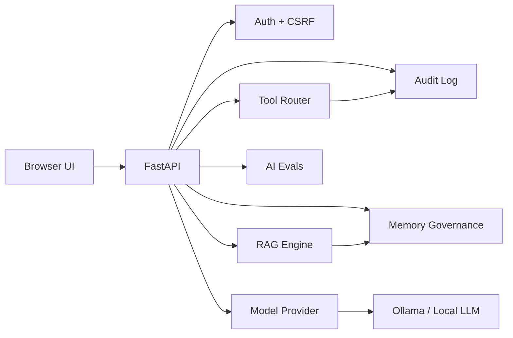
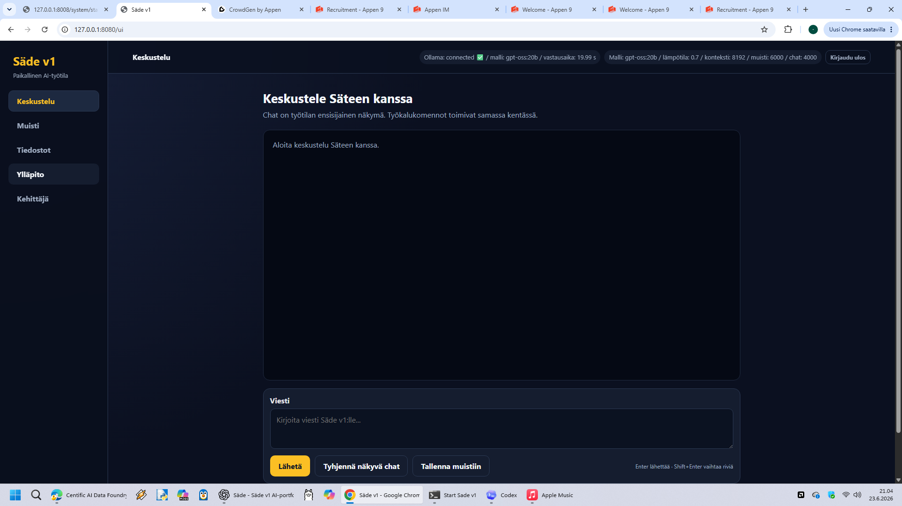
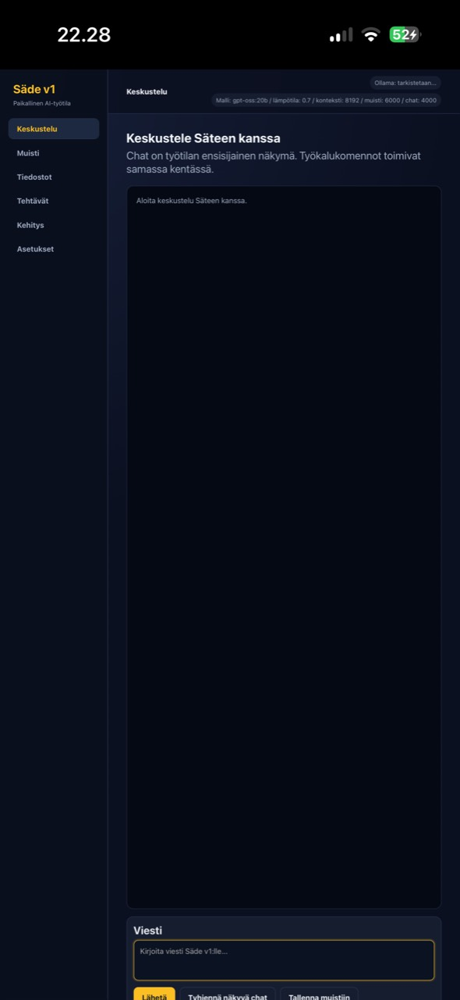

# Säde v1 — Local AI Workspace


Säde v1 is a local-first AI assistant workspace built with Python, FastAPI, a browser UI, local model providers, memory, RAG, audit logging, evals, and explicit safety boundaries.

The project is designed as a portfolio-grade AI engineering project: it demonstrates not only model interaction, but also testability, memory governance, tool permissions, prompt-injection awareness, authentication, and release hygiene.

## What this project demonstrates

- Building a local AI assistant with FastAPI and a browser UI.
- Designing memory and RAG workflows with explicit truth boundaries.
- Separating user-facing features from advanced developer tools.
- Implementing authentication, CSRF protection, audit logging, and backup workflows.
- Adding AI evals, prompt-injection checks, tool risk policies, and release readiness checks.
- Writing a portfolio-friendly open-source project surface: README, QUICKSTART, SECURITY, CONTRIBUTING, CI, issue templates, and changelog.

## What this demonstrates to employers

Säde v1 demonstrates practical AI engineering rather than only prompt experimentation:

- local AI application architecture with FastAPI;
- authentication, CSRF protection, audit logging, and guarded file tools;
- RAG, semantic memory, web-search truth boundaries, and AI eval entrypoints;
- test-driven hardening with `pytest`, coverage reports, and release readiness checks;
- portfolio-quality documentation and a maintainable GitHub project surface.

## Highlights

- **Local-first AI workspace** using Ollama through a model provider layer.
- **Chat, memory, sources, and settings** as the user-facing UI.
- **Finnish/English UI language switch** (`fi` / `en`).
- **Memory governance**: list memories, export memory, guarded deletion API.
- **RAG and source quality checks** for safer retrieval-assisted answers.
- **Prompt injection detection** and tool risk classification.
- **Audit log and debug trace** for safety and observability.
- **Kirjautumissuojaus** with local users, CSRF protection, and session cookies.
- **Static and live AI eval entrypoints**.
- **Backup/restore workflow** for local data.
- **GitHub Actions CI** with pytest and coverage reporting.

## Architecture



More detail: [docs/architecture.md](docs/architecture.md)

## Screenshots

The current portfolio screenshots are:





More screenshot notes: [docs/screenshots/README.md](docs/screenshots/README.md).

## Quickstart

```powershell
cd C:\Sade\Sade-v1
.\.venv\Scripts\python.exe -m pip install -r requirements.txt
.\app\create_sade_user.bat
.\.venv\Scripts\python.exe -m uvicorn app.main:app --host 127.0.0.1 --port 8080
```

Open:

```text
http://127.0.0.1:8080/ui
```

More detail: [QUICKSTART.md](QUICKSTART.md)

## Tests

```powershell
.\.venv\Scripts\python.exe -m pytest -q
```

Current local status:

```text
85 passed
coverage: 62%
release_readiness: ok true
```

Coverage locally:

```powershell
.\.venv\Scripts\python.exe -m pip install pytest-cov
.\.venv\Scripts\python.exe -m pytest --cov=app --cov-branch --cov-report=term-missing --cov-report=html
```

Release readiness:

```powershell
.\.venv\Scripts\python.exe scripts\release_readiness.py
```

## Demo path

Try these in order:

1. Open the UI and send a chat message.
2. Add a memory in **Memory**.
3. Upload a document in **Sources**.
4. Search from sources in advanced tools.
5. Run static evals.
6. Create a backup archive.
7. Check audit status.

## Key routes

| Route | Purpose |
|---|---|
| `/ui` | Browser UI |
| `/chat` | Chat endpoint |
| `/auth/status` | Authentication status |
| `/memory/entries` | List memory entries |
| `/memory/export` | Export memory |
| `/backup/archive` | Create zip backup |
| `/rag/search` | Source-aware retrieval |
| `/rag/quality` | RAG quality gate |
| `/tools/policies` | Tool risk policies |
| `/evals/static` | Static AI evals |
| `/evals/live` | Optional live model evals |
| `/debug/trace` | Developer trace |

## Safety model

Säde v1 is intended for local or trusted-network use. Do not expose it directly to the public internet.

Safety principles:

- Web results are sources, not automatic truth.
- Personal memory is not committed to Git.
- High-risk tool actions are audited.
- Developer tools are behind advanced settings.
- Secrets, sessions, vector DBs, uploads, and backups are excluded from the public repo.

See [SECURITY.md](SECURITY.md).

## Documentation

- [Architecture](docs/architecture.md)
- [Code Rewrite Protocol](docs/code_rewrite_protocol.md)
- [Authentication Policy](docs/authentication_policy.md)
- [Tool Risk Policy](docs/tool_risk_policy.md)
- [AI Evaluation Policy](docs/ai_evaluation_policy.md)
- [Memory Governance Policy](docs/memory_governance_policy.md)
- [Backup/Restore Policy](docs/backup_restore_policy.md)
- [Repo Cleanup Plan](docs/repo_cleanup_plan.md)

## Project status

Säde v1 is a portfolio-stage AI assistant project. It is not a commercial SaaS product and should not be treated as production-ready infrastructure without additional hardening, deployment review, and operational monitoring.

## License

MIT License. See [LICENSE](LICENSE).
