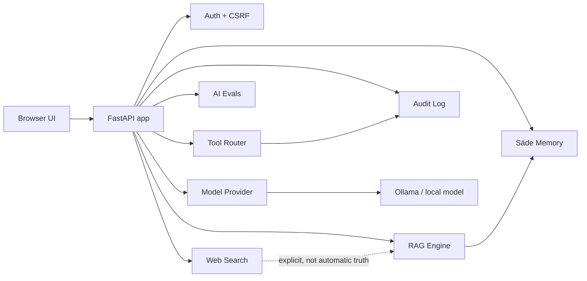

# Säde v1 Architecture

Säde v1 is a local-first AI workspace built around a FastAPI backend, browser UI, local model provider, memory, RAG, audit logging, and safety policies.

## Main modules

| Module | Responsibility |
|---|---|
| `app/main.py` | FastAPI routes, UI serving, chat orchestration |
| `app/model_provider.py` | Model backend abstraction, currently Ollama |
| `app/tool_router.py` | Natural-language tool routing |
| `app/rag_engine.py` | Source-aware retrieval and ranking |
| `app/semantic_memory.py` | Semantic memory index/search |
| `app/audit_log.py` | Append-only safety-relevant event log |
| `app/tool_permissions.py` | Tool risk classification |
| `app/prompt_injection.py` | Prompt injection detection helpers |
| `app/ai_evals.py` | Static AI behavior evals |
| `app/live_evals.py` | Optional live model evals |
| `app/memory_governance.py` | Memory export/list/delete governance |
| `app/backup_restore.py` | Zip backup and restore workflow |
| `app/language_pack.py` | Finnish-first language policy and terminology |

## Safety boundaries

- Web search results are sources, not truth by themselves.
- Memory writes require explicit user action or a documented workflow.
- High-risk tools are audited.
- Personal memory data and sessions are excluded from Git.
- Developer tools are hidden behind advanced settings in the UI.
